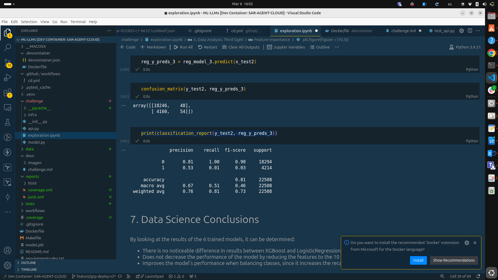
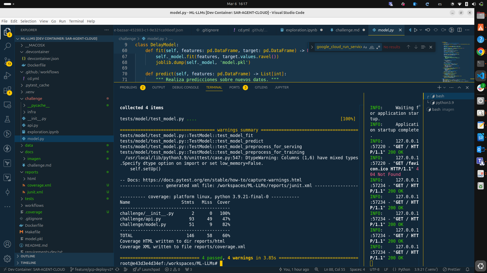
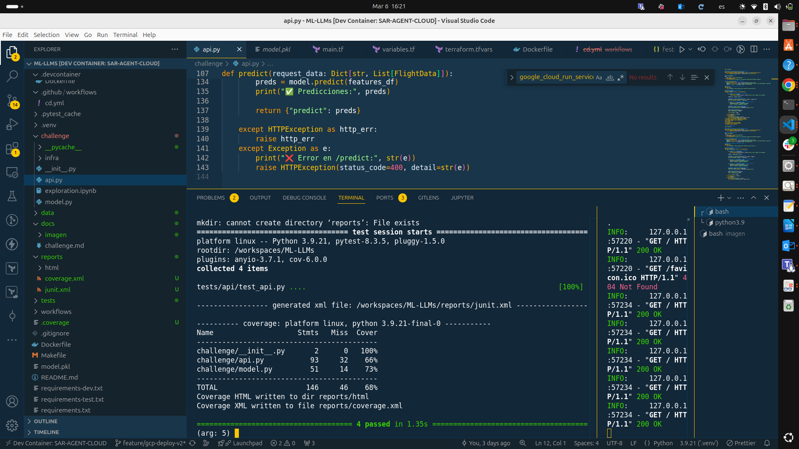
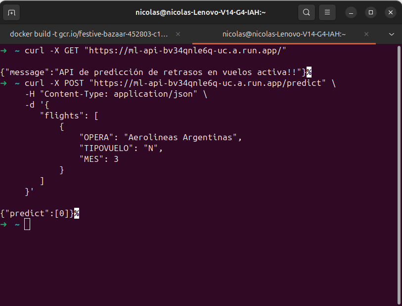
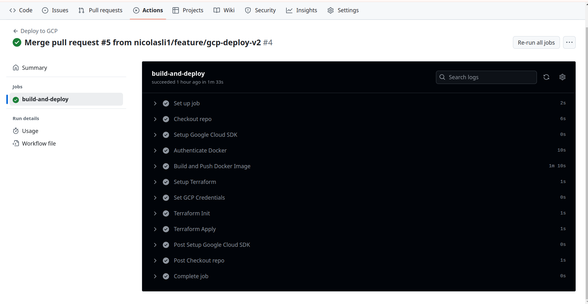
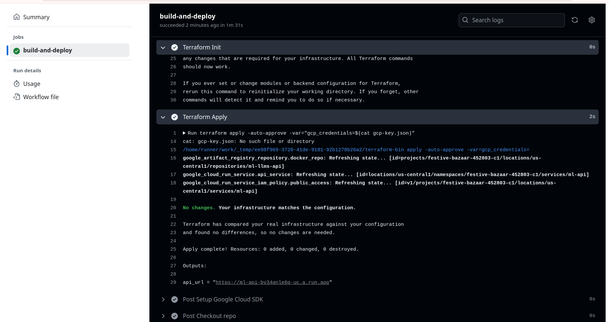

# Solución del Problema

## Entorno de Desarrollo

Para abordar este problema, primero se creó un entorno de desarrollo dentro de un Dev Container. Esta herramienta es muy útil, ya que permite ejecutar los procesos dentro de un contenedor, asegurando un entorno consistente y reproducible. El código correspondiente a este contenedor se encuentra en la ruta `.devcontainer/Dockerfile`.

## Instalación de Dependencias

Una vez configurado el entorno, se procedió a instalar las dependencias necesarias para ejecutar el proyecto correctamente.

## Corrección de Errores en Jupyter Notebook

Durante la ejecución del archivo `challenge/exploration.ipynb` en Jupyter, se detectaron algunos errores. Se realizaron las modificaciones necesarias para corregirlos, logrando que el notebook funcionara correctamente. Esto se puede verificar en la siguiente imagen:





### Implementación del Modelo en `model.py`

Después de validar el análisis en Jupyter, el siguiente paso consistió en trasladar la lógica del modelo a `challenge/model.py`. Este archivo tiene como objetivo exportar la implementación del modelo, garantizando que pueda ser utilizado en un entorno más estructurado y reproducible.

Durante esta fase, se realizaron las siguientes acciones:

1. **Transcripción del código del notebook a `model.py`**: Se replicaron las transformaciones de datos y la lógica del modelo en el script de Python.
2. **Corrección de errores**: Se identificaron y corrigieron posibles inconsistencias que surgieron al trasladar el código desde el notebook.
3. **Modularización del código**: Se organizaron las funciones en una estructura clara y reutilizable.
4. **Validación con pruebas**: Se ejecutaron las pruebas proporcionadas en el challenge para asegurar el correcto funcionamiento del modelo con el comando:
   ```bash
   make model-test




### Construcción de la API en `api.py`

Después de implementar y validar el modelo, el siguiente paso fue la construcción de la API en `challenge/api.py`. Esta API se encargará de exponer el modelo previamente entrenado (`model.pkl`) para que pueda ser consultado externamente.

Las acciones realizadas en esta fase fueron:

1. **Creación de la API en `challenge/api.py`**: Se desarrolló la API utilizando FastAPI, asegurando que el modelo pueda recibir peticiones y devolver predicciones de manera eficiente.
2. **Carga del modelo entrenado**: Se integró la lógica para cargar `model.pkl`, permitiendo que la API utilice el modelo en producción.
3. **Definición de los endpoints**: Se establecieron los endpoints necesarios para procesar las solicitudes y retornar las predicciones del modelo.
4. **Ejecución de pruebas**: Para garantizar que la API funcione correctamente, se ejecutaron las pruebas con el siguiente comando:
   ```bash
   make api-test




### Pruebas en entorno local

Además de ejecutar las pruebas automáticas, se realizaron pruebas en un entorno local para validar el correcto funcionamiento de la API antes de su despliegue en la nube.

Ejecutamos el siguiente comando 

   ```bash
   uvicorn challenge.api:app --reload --host 0.0.0.0 --port 8000
   ```


### Construcción de la API Dockerizada

Una vez validado el correcto funcionamiento de la API en el entorno local, se procede a su dockerización. El código para la construcción del contenedor se encuentra en el archivo `Dockerfile`.

En este `Dockerfile`, se define la imagen base y se incluyen todas las dependencias necesarias, incluyendo el modelo previamente entrenado (`model.pkl`). Se asegura que la API esté lista para ejecutarse en un entorno de producción.

A continuación, se construye la imagen del contenedor ejecutando:

   ```bash
   docker build -t api-flight-delay .
```


### Implementación de Infraestructura como Código (IaC) con Terraform

Una vez validado el funcionamiento de la API en un entorno local y dockerizada, procedemos a la creación de la infraestructura necesaria en Google Cloud Platform (GCP) utilizando Terraform. Todo el código relacionado con la infraestructura se encuentra en la ruta `challenge/infra/terraform`.

En este módulo de Terraform, se configuran los siguientes componentes clave:

- **Conexión con GCP**: Se establecen las credenciales y la configuración necesaria para interactuar con los servicios de GCP.
- **Cloud Run Service**: Se define el servicio en Cloud Run, permitiendo desplegar la API como un servicio administrado.
- **Configuración de API Services**: Se habilitan las APIs necesarias en GCP para el correcto funcionamiento del despliegue.
- **Exposición de la API**: Se configura el servicio para que sea accesible públicamente, utilizando la imagen del contenedor previamente construida.

Una vez definida la infraestructura, se procede con la ejecución de Terraform para desplegar los recursos:

   ```bash
   terraform init
   terraform apply -auto-approve
```
el log de salida lo podremos ver mas adelante en el pipeline 

### Pruebas de la API en Google Cloud Run

Una vez desplegada la API en Google Cloud Run, realizamos pruebas para verificar su correcto funcionamiento.

#### 1️⃣ Probar el Endpoint de Salud (GET `/`)

Para comprobar que la API está activa, ejecutamos el siguiente comando en la terminal:

   ```bash
   curl -X GET "https://ml-api-bv34qnle6q-uc.a.run.app/"
```
Para validar la funcionalidad del modelo de predicción, enviamos una solicitud con datos de prueba:


   ```bash
   curl -X POST "https://ml-api-bv34qnle6q-uc.a.run.app/predict" \
      -H "Content-Type: application/json" \
      -d '{
         "flights": [
               {
                  "OPERA": "Aerolineas Argentinas",
                  "TIPOVUELO": "N",
                  "MES": 3
               }
         ]
      }'
```
La API responderá con la predicción, indicando si el vuelo tendrá un retraso (1) o no (0)



### Modificación del Pipeline para Despliegue Automático

Una vez completadas las pruebas de la API, procedemos a modificar el pipeline de CI/CD para automatizar el despliegue de Terraform en GCP y la actualización de la imagen en Cloud Run en caso de cambios en el código.

Este proceso se gestiona en el archivo:

📌 `.github/workflows/cd.yml`

### Funcionalidad del Pipeline

- **Conexión con GCP:** Se configura la autenticación con GCP para poder ejecutar Terraform y desplegar la infraestructura.
- **Ejecución de Terraform:** Se aplican los cambios en la infraestructura en caso de modificaciones en los archivos de Terraform.
- **Construcción y despliegue de la imagen:** Si hay cambios en el código de la API, se construye una nueva imagen de Docker y se sube al container registry de GCP.
- **Actualización de la API en Cloud Run:** Se actualiza el servicio de Cloud Run con la nueva imagen desplegada.

Este pipeline garantiza que cada cambio en el código o en la infraestructura se refleje automáticamente en el entorno de producción sin intervención manual.


En la siguiente imagen podemos ver el despliegue CD 




### Implementación del Pipeline de CI

Inicialmente, la idea era incorporar herramientas de validación de código estático y dinámico para mejorar la calidad y seguridad del código. Se consideraron las siguientes herramientas:

- **SonarQube/SonarCloud**: Para análisis de calidad del código y detección de bugs o code smells.
- **Dependabot**: Para la actualización automática de dependencias.
- **OWASP Dependency-Check / Safety**: Para detectar vulnerabilidades en las dependencias del proyecto.

Sin embargo, debido a limitaciones de tiempo, estas herramientas no fueron integradas en esta versión del pipeline. 
